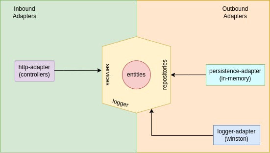

# Shopping Cart API

## Architecture

I opted for using hexagonal architecture to keep the application business logic decoupled from dependencies allowing easier testing and flexibility to change drivers through the ports-adapters mechanism.

```
├── config              // app general configs
├── core                // custom types, classes and interfaces, global configurations(logger)
│   ├── either.ts       // custom type for handling success or errors in functions responses
│   └── logger.ts
├── domain              // app domain containing all the application logic decoupled from dependencies
│   ├── entities        // app entities containing business entities, easy to test and to reuse across many services
│   ├── errors          // app errors
│   ├── ports           // repositories,services and logger interfaces
│   │   ├── logger
│   │   ├── mocks       // repositories mocks to use in tests
│   │   ├── repositories
│   │   └── services
│   └── services        // app services
├── infra
│   ├── database        // in-memory repository concrete implementations
│   └── logger          // concrete logger implementation
├── presentation
│   ├── controllers     // request handlers
│   ├── dtos            // request/response body interfaces
│   └── middlewares
├── types               // custom extension of Express type
├── container.ts        // dependency injection container
└── index.ts
```

### Diagram



### Concrete database:

In order to focus on testing and domain logic, I chose to implement an In-Memory database.
Since the domain in protected by repositories ports(interfaces), implementing any other concrete repository, such as mysql or postgres, will be safe.

### Testing:

The app has unit tests for domain/entities and domain/services and integrated tests, in presentation/controllers
Tests are in the same level as the tested file in order to facilitate visualization.

Example:

```
├── cart.entity.test.ts
├── cart.entity.ts
```

## Preset Data

App starts with 3 items as stated in the challenge:

```
| itemId | name    | price |
| ------ | ------- | ----- |
| 1      | T-shirt | 12.99 |
| 2      | Jeans   | 25.00 |
| 3      | Dress   | 20.65 |
```

For the initial user, I simulated a token based authentication.
The token for the initial user can be set via USER_TOKEN variable in .env file.
The initial value set in .env.example is 1bd01725-7b40-4bae-89fb-6cdd36f66614

## Main features

- logging level
- request id for requests and logs
- request id for app logs(thanks to async local storage)
- simple graceful shutdown
- git hooks
  - commit linting
  - testing
  - linting

## Limitations

### Request validations

- As the application is small it doesnt use any jsonschema or other object validator.

### Persistence and Isolation Level

- It does not support transactions and persistence, so it can't scale horizontally.

### Multi-user and Authentication

- It supports only one user and doesnt have a real token-based authentication mechanism.

## Running commands

Run tests via docker:

```
make test
```

Run application in dev mode:

```
make run-dev
```

Run application in prod mode:

```
make run-prod
```

## Endpoints

Get cart with total price calculated:

```
curl --location --request GET 'localhost:3000/api/v1/cart' \
--header 'Authorization: 1bd01725-7b40-4bae-89fb-6cdd36f66614'
```

Response Body:

```
{
    "items": [
        {
            "item": {
                "id": number,
                "name": "string",
                "price": number
            },
            "amount": number
        },
    ],
    "totalPrice": number,
    "discountPrice": number,
    "discount": number
}
```

Add item to cart

```
curl --location 'localhost:3000/api/v1/cart' \
--header 'Authorization: 1bd01725-7b40-4bae-89fb-6cdd36f66614' \
--header 'Content-Type: application/json' \
--data '{
    "itemId":3,
    "amount":1
}'
```

Remove item from cart

```
curl --location --request DELETE 'localhost:3000/api/v1/cart/item/3' \
--header 'Authorization: 1bd01725-7b40-4bae-89fb-6cdd36f66614'
```
